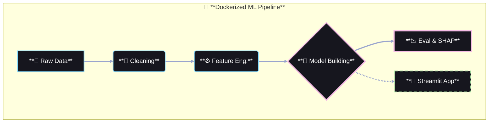

# 👋 Hi, I'm Arthur (chgwyellow)

I enjoy immersing myself in the world of programming —  
exploring data, building systems, and creating things that actually work.  
My goal is to grow into someone who can turn ideas into scalable and reliable data solutions.

---

## 🌟 About Me

- ✈️ Aviation enthusiast with a deep passion for **aircraft** and the **aviation industry**
- 🚀 Focused on **Data Engineering** and **Data Analytics**
- 📊 Passionate about transforming raw data into actionable insights through robust data pipelines
- 🌱 Learning by building real projects and experimenting with real-world datasets

---

## 📊 GitHub Stats

  
   

  
  
   

  
  

   
  <picture>
    <source media="(prefers-color-scheme: dark)" srcset="https://raw.githubusercontent.com/chgwyellow/chgwyellow/output/github-contribution-grid-snake-dark.svg">
    <source media="(prefers-color-scheme: light)" srcset="https://raw.githubusercontent.com/chgwyellow/chgwyellow/output/github-contribution-grid-snake.svg">
    
  </picture>

---

## 🛠️ Tech Stack

| Category | Skills |
| :--- | :--- |
| **Languages** |   |
| **Data Engineering** |      |

---

## ⏳ Weekly Coding Stats

  

---

## 📂 Featured Project

### 🔹 **Air Quality Prediction System (End-to-End ML Pipeline)**

📌 **A comprehensive machine learning project predicting AQI using real-world environmental data.**

- **Pipeline:** Designed a robust workflow including Data Cleaning, Feature Engineering, and Model Evaluation.
- **Model Selection:** Conducted comparative analysis between **Deep Learning (LSTM)** and **Gradient Boosting (LightGBM)**.
- **Result:** **LightGBM** achieved superior performance (higher R²) and efficiency compared to LSTM for this tabular dataset.
- **Deployment:** Containerized the solution using Docker and deployed a user interface via Streamlit.

🔗 Repo: <https://github.com/chgwyellow/air_pollution>

### 🏗️ Workflow Architecture

```mermaid
graph LR
    classDef data fill:#16161e,stroke:#89ddff,stroke-width:2px,color:#fff
    classDef model fill:#16161e,stroke:#f5bde6,stroke-width:3px,color:#fff
    classDef deploy fill:#16161e,stroke:#a6e3a1,stroke-width:2px,color:#fff,stroke-dasharray: 8 5
    
    subgraph Pipeline [🐳 **Dockerized ML Pipeline**]
        direction LR
        Raw[**📂 Raw Data**]:::data --> Clean(**🧹 Cleaning**):::data
        Clean --> Feat(**⚙️ Feature Eng.**):::data
        Feat --> Train{**🤖 Model Building**}:::model
        
        Train --> Eval[**📉 Eval & SHAP**]:::model
        Train -.-> App[**🚀 Streamlit App**]:::deploy
    end

    linkStyle default stroke:#9aa5ce,stroke-width:3px;
```

---

## 📫 Contact Me

📧 **<dinnis1107@gmail.com>**
