# 👋 Hi, I'm Arthur (chgwyellow)

I enjoy immersing myself in the world of programming —  
exploring data, building systems, and creating things that actually work.  
My goal is to grow into someone who can turn ideas into scalable and reliable data solutions.

---

## 🌟 About Me

- 🚀 Passionate about **Data Engineering**, **Data Science**, **Machine Learning**, and **Deep Learning**
- 🔧 Strengthening skills in Python, SQL, data pipelines, databases, and cloud-native tools
- 🧠 Exploring **LLM workflows**, especially **RAG**, vector databases, and prompt engineering
- 🌱 Learning by building real projects and experimenting with real-world datasets
- 💼 Open to opportunities in **DE / DS / ML Engineering**

---

## 📊 GitHub Stats

  
   

  
  
   

  
  

   
  <picture>
    <source media="(prefers-color-scheme: dark)" srcset="https://raw.githubusercontent.com/chgwyellow/chgwyellow/output/github-contribution-grid-snake-dark.svg">
    <source media="(prefers-color-scheme: light)" srcset="https://raw.githubusercontent.com/chgwyellow/chgwyellow/output/github-contribution-grid-snake.svg">
    
  </picture>

---

## 🛠️ Tech Stack

| Category | Skills |
| :--- | :--- |
| **Languages** |   |
| **Data Engineering** |    |
| **Data Science & ML** |    |  |

---

## 📂 Featured Project

### 🔹 **Air Quality Prediction System (End-to-End ML Pipeline)**

📌 **A comprehensive machine learning project predicting AQI using real-world environmental data.**
* **Pipeline:** Designed a robust workflow including Data Cleaning, Feature Engineering, and Model Evaluation.
* **Model Selection:** Conducted comparative analysis between **Deep Learning (LSTM)** and **Gradient Boosting (LightGBM)**.
* **Result:** **LightGBM** achieved superior performance (higher R²) and efficiency compared to LSTM for this tabular dataset.
* **Deployment:** Containerized the solution using Docker and deployed a user interface via Streamlit.

🔗 Repo: https://github.com/chgwyellow/air_pollution

### 🏗️ Workflow Architecture

```mermaid
graph LR
    classDef data fill:#16161e,stroke:#89ddff,stroke-width:2px,color:#fff
    classDef model fill:#16161e,stroke:#f5bde6,stroke-width:3px,color:#fff
    classDef deploy fill:#16161e,stroke:#a6e3a1,stroke-width:2px,color:#fff,stroke-dasharray: 8 5
    
    subgraph Pipeline [🐳 **Dockerized ML Pipeline**]
        direction LR
        Raw[**📂 Raw Data**]:::data --> Clean(**🧹 Cleaning**):::data
        Clean --> Feat(**⚙️ Feature Eng.**):::data
        Feat --> Train{**🤖 Model Building**}:::model
        
        Train --> Eval[**📉 Eval & SHAP**]:::model
        Train -.-> App[**🚀 Streamlit App**]:::deploy
    end

    linkStyle default stroke:#9aa5ce,stroke-width:3px;
```

---

## 📫 Contact Me
📧 **dinnis1107@gmail.com**
